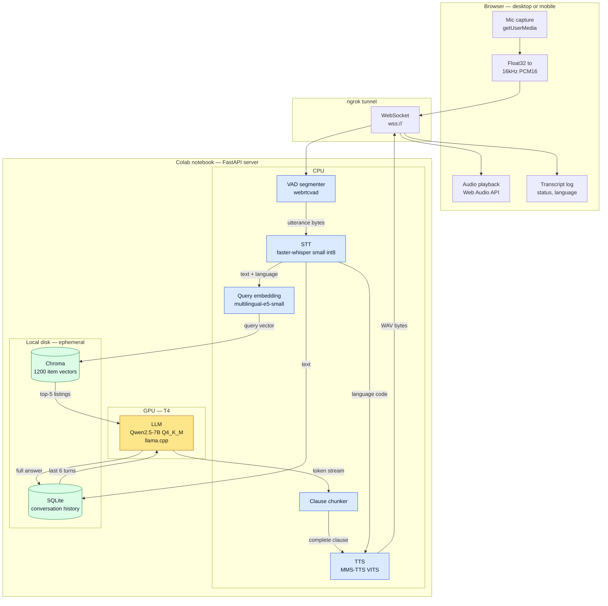
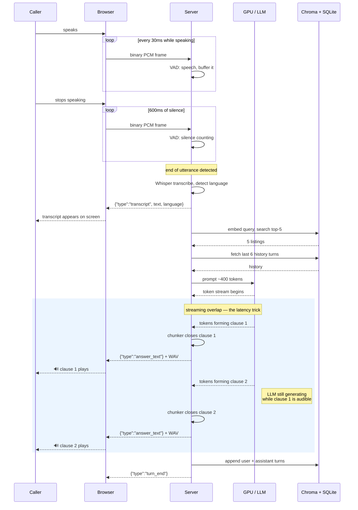
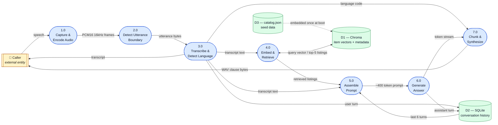

# Interview Defense Notes — Voice-to-Voice RAG Agent

Personal reference for defending the architecture, data flow, latency, cost and optimization choices in this demo.

> ## ⚠️ On the numbers in this document
>
> **The system isn't built yet, so nothing here has been measured.** Every latency and cost figure is an *estimate derived from published model and hardware characteristics*, with the arithmetic shown so the reasoning is defensible even before the real numbers exist.
>
> The durable content of this document is **§2 (how it works), §6 (why each choice was made), §7 (what's still broken), and §10 (taking this to a real phone call)**. Those don't change when measurements land. The numbers get filled in from [§12 Measurement checklist](#12-measurement-checklist) once the build is running.
>
> Two rules for the interview:
> 1. Say **"estimated"** out loud for anything not yet measured. A labeled estimate with visible arithmetic beats a confident wrong number every time.
> 2. Cloud prices quoted in §4 are approximate as of early 2026 — **verify on the vendor's pricing page** before the interview. Prices move.

---

## 1. The 60-second pitch

A caller speaks; the agent answers questions about a 1,200-item inventory catalog, in English, Hindi or Marathi, over a phone-style voice interface.

Audio streams from the browser over a WebSocket to a Python server running in a Colab notebook, exposed by an ngrok tunnel. On the server: VAD detects when the caller stopped talking → Whisper transcribes and detects the language → the query is embedded and matched against a Chroma vector index of the catalog → a local quantized LLM answers using only the retrieved listings → each clause is synthesized to speech as it completes and streamed back.

**The one design idea worth leading with:** the GPU holds exactly one model. STT and TTS were deliberately chosen to be CPU-native so the entire VRAM budget belongs to the LLM. That single constraint drove the model choice at every other stage — and it also created the system's main latency bottleneck, which is a tradeoff worth discussing honestly (§7.1).

---

## 2. How it works

### 2.1 System architecture



**Reading the colors:** blue is CPU, amber is GPU, green is storage. One amber box. That's the whole VRAM strategy in a glance.

### 2.2 A single turn, end to end

Walk this narrative when asked "so how does it actually work?"

1. **Capture.** The browser holds a WebSocket open and streams continuously. `getUserMedia` gives Float32 samples; the client converts them to 16kHz mono 16-bit PCM — the format Whisper and webrtcvad both expect — and sends raw binary frames. No buffering-then-uploading; audio is in flight while the caller is still talking.

2. **Turn detection.** The server pushes each 30ms frame into `UtteranceSegmenter`. webrtcvad classifies frames as speech or silence. Once 600ms of continuous silence follows speech, the segmenter returns the buffered utterance. **This is what replaces a push-to-talk button** — the caller just stops talking and the system notices.

3. **Transcription.** The utterance is written to a scratch WAV and handed to faster-whisper, which returns both the text and an auto-detected language code. That language code is carried all the way through the turn — it selects the TTS voice at the end, which is how a Hindi question gets a Hindi answer without anyone configuring anything.

4. **Retrieval.** The transcript is embedded with `multilingual-e5-small` using the `query:` prefix, and Chroma returns the 5 nearest catalog items by cosine distance. The catalog was embedded once at startup with the `passage:` prefix. This asymmetry is deliberate — e5 is trained to align short questions against longer descriptions, *and across languages*, which is the only reason a Hindi query can match an English product record.

5. **Prompt assembly.** `build_prompt` combines a short fixed system prompt, the 5 retrieved listings truncated to `name / price / stock / category`, the last 6 turns of history from SQLite, and the user's question. Total ≈ 400 tokens, and — the important property — **that total is constant** regardless of catalog size or how long the call has run.

6. **Generation.** llama.cpp streams tokens off the GPU. The server does not wait for the full answer.

7. **Clause-level speech.** Each token fragment goes into `ClauseChunker`, which emits a clause the moment punctuation closes it. That clause is immediately synthesized and the WAV bytes pushed to the browser. **This overlap is the core latency trick:** TTS for clause 1 runs while the LLM is still generating clause 2, so the caller starts hearing the answer long before it finishes existing.

8. **Persistence and close-out.** The user's transcript and the assembled answer are appended to SQLite, and a `turn_end` message tells the client the turn is over.

### 2.3 Turn sequence — where the overlap happens



The shaded block is the answer to "why bother streaming?" Without it, the caller waits for generation *and then* a full TTS pass. With it, those two costs overlap.

### 2.4 Data flow diagram

Level-1 DFD in standard notation — external entity, numbered processes, data stores, labeled flows.



**Three things this diagram makes obvious, and each is worth pointing at:**

- **The language code from process 3.0 skips the entire middle of the pipeline** and lands directly on 7.0. Language detection happens once, at transcription, and is simply carried forward. No separate language-detection step, no configuration.
- **D1 is written once at boot and read-only thereafter.** Embedding cost is paid 1,200 times at startup and once per turn afterwards — never per turn per item.
- **D2 is both read and written every turn**, and it's the only true state in the system. Everything else is a pure transformation, which is why every module was independently testable without the others.

### 2.5 Wire protocol

The single contract between browser and server. Endpoint `/ws/{session_id}`.

| Direction | Frame | Meaning |
|---|---|---|
| Client → Server | binary | Raw 16kHz mono PCM16 chunk |
| Client → Server | `"__end__"` | Force end-of-turn — push-to-talk release, and tests |
| Server → Client | `{"type":"transcript","text","language"}` | Sent once, immediately after STT |
| Server → Client | `{"type":"answer_text","text"}` | One per clause, immediately before that clause's audio |
| Server → Client | binary | WAV bytes for the clause just announced |
| Server → Client | `{"type":"turn_end"}` | Turn complete |

Text-then-audio per clause is deliberate: the transcript renders on screen slightly ahead of the audio playing, which reads as responsive rather than laggy.

---

## 3. Latency budget (estimated — not yet measured)

Target hardware: Colab free tier — **2 vCPU** (Xeon @ ~2.2GHz) and one **T4 GPU** (16GB, 320 GB/s memory bandwidth).

The number that matters in a voice interface is **time-to-first-audio**: how long after the caller stops speaking before they hear anything.

| # | Stage | Estimate | Where the number comes from |
|---|---|---|---|
| 1 | VAD silence confirmation | **600 ms** | Configured directly (`silence_ms=600`). A choice, not a measurement. |
| 2 | STT — faster-whisper small int8, CPU | **1.5 – 3.5 s** | 3s utterance at an estimated real-time factor of 0.5–1.2 on 2 vCPU. The same model runs ~0.1–0.2 RTF on an 8-core desktop; Colab's 2 vCPU is several times slower. **This is the bottleneck.** |
| 3 | Query embedding — e5-small, CPU | **10 – 40 ms** | 118M-param encoder, single short sequence. |
| 4 | Chroma vector search | **< 5 ms** | 1,200 vectors × 384 dims. Trivially small. |
| 5 | LLM prefill (~400-token prompt) | **0.5 – 1.2 s** | 7B Q4 on T4 prefills at roughly 400–900 tok/s. |
| 6 | LLM generates first clause (~12 tokens) | **0.3 – 0.5 s** | T4 bandwidth ceiling 320 GB/s ÷ 4.7GB ≈ 68 tok/s theoretical; llama.cpp realistically **25–40 tok/s**. |
| 7 | TTS first clause — MMS-TTS VITS, CPU | **0.6 – 1.2 s** | VITS is non-autoregressive — one forward pass, not token-by-token. Estimated RTF 0.3–0.6 on 2 vCPU. |
| 8 | Network — ngrok round trip | **100 – 300 ms** | Free-tier tunnel, likely cross-region. |
| | **Total time-to-first-audio** | **≈ 3.6 – 7.3 s** | |

### What to say about that number

Don't defend it as good. It isn't — natural conversation wants sub-1.5s. Say:

> "It's a demo on free Colab, and the estimated time-to-first-audio is around four to seven seconds. About half of that is Whisper on two vCPUs. I know exactly which lever fixes it and why I didn't pull it — want me to walk through that?"

That demonstrates you profiled your own system rather than hoping nobody asked.

---

## 4. Cost model

### 4.1 Self-hosted (this demo)

| Item | Cost |
|---|---|
| Colab free tier | $0, with usage caps and disconnects |
| Colab Pro, if needed for stability | ~$10/month |
| Equivalent rented T4 on-demand | ~$0.35/hour ≈ **$252/month** if always on |
| ngrok free tunnel | $0, bandwidth-capped — see §8 |

Per-call, 3-minute call, **one call at a time**: `0.05 hr × $0.35/hr ≈ $0.0175`

### 4.2 Cloud API equivalent — the comparison they will ask for

Model a 10-turn, 3-minute call: 50s of caller audio, ~1,500 characters synthesized, 10 LLM calls at ~400 prompt + 60 output tokens.

| Component | Approximate rate *(verify before interview)* | Per call |
|---|---|---|
| STT, Deepgram Nova-class streaming | ~$0.0043 / min | 0.83 min → **$0.0036** |
| TTS, Deepgram Aura-class | ~$0.015 / 1K chars | 1,500 chars → **$0.0225** |
| LLM, small/fast tier | ~$0.25/M in, ~$1.25/M out | 4K in + 600 out → **$0.0018** |
| | **Total** | **≈ $0.028 per call** |

Note which component dominates: **TTS is ~80% of the API bill**, not the LLM. Counterintuitive, specific, and it signals you did the math rather than repeating a blog post.

### 4.3 Break-even — the answer to "why not just use APIs?"

```
Always-on GPU:      $252 / month
API cost per call:  $0.028
Break-even:         $252 ÷ $0.028  ≈  9,000 calls/month  ≈  300 calls/day
```

> "Below roughly 9,000 calls a month the APIs are cheaper — you pay per use instead of paying for an idle GPU. Self-hosting only wins at sustained volume, and only if you batch concurrent calls onto that GPU. I self-hosted here for different reasons: no API keys, no per-request billing during development, full control over the multilingual voice stack, and the whole thing reproduces in a notebook. For a production product at low volume I'd start on APIs and revisit at scale."

That reframes the choice as deliberate and situational rather than a default.

---

## 5. Token optimization — with the numbers

Have the ratio ready, not just the technique.

### 5.1 Retrieval instead of stuffing — the big one

| Approach | Prompt tokens | Note |
|---|---|---|
| Whole catalog in the prompt | ~21,600 names/prices only, ~42,000 with descriptions | Exceeds the 4,096-token context entirely — **not merely expensive, impossible** |
| Top-5 retrieved, essential fields | **~90** | ~240× smaller than the names-only version |

### 5.2 Field truncation

The prompt carries `name, price, stock, category` — not the full record with description text. ~18 tokens per listing instead of ~35, a ~2× cut on the retrieved block.

### 5.3 Full prompt budget

| Segment | Tokens |
|---|---|
| System prompt, fixed | ~60 |
| 5 retrieved listings | ~90 |
| 6 windowed history turns | ~150 |
| User query + scaffolding | ~30 |
| **Total** | **≈ 330 – 420** |

**The headline claim:** this budget is **constant**. It doesn't grow with catalog size (retrieval caps it) or with call length (the history window caps it). A 50-turn call costs the same per turn as a 2-turn call — in a voice product where calls run long, that's the difference between predictable and runaway cost.

### 5.4 The rest

- **4-bit quantization (Q4_K_M):** ~4.7GB instead of ~15GB at fp16 — ~3× smaller, and the only reason a 7B model fits a T4 with headroom.
- **Stop sequences** (`"user:"`) halt generation at the answer instead of letting the model hallucinate the next turn of dialogue — saves tokens *and* prevents a failure class.
- **Embeddings computed once** at catalog load and cached in Chroma; only the live query is embedded per turn.
- **`temperature=0.3`** — low, because this is retrieval-grounded factual answering, not creative writing.

---

## 6. Architecture decision log

The format for each: the question, the answer, the honest tradeoff. **This section is the core of the document** — it holds regardless of what the measurements turn out to be.

### Why a local LLM instead of an API?
Reproducibility and control — the whole demo runs in one notebook with no keys and no per-request billing. **Tradeoff:** a 7B model is meaningfully weaker at reasoning than a frontier API model, and I pay for the GPU whether or not anyone calls. See the break-even in §4.3.

### Why Qwen2.5-7B specifically?
Strong multilingual coverage including Indic languages, permissive licensing, well-maintained GGUF ecosystem. At Q4_K_M it fits a T4 with room to spare. **Tradeoff:** a 3B model would have roughly halved latency; I chose answer quality because retrieval-grounded answering still requires reading and comparing five listings correctly.

### Why llama.cpp instead of vLLM?
vLLM's advantages — continuous batching, PagedAttention, high throughput — are all *concurrency* advantages. This demo has exactly one caller, so they buy nothing, while llama.cpp has far lower setup overhead on Colab and clean token streaming. **Tradeoff:** the moment this serves concurrent calls, vLLM becomes correct. That's the migration in §9.

### Why Chroma instead of Pinecone / pgvector / FAISS?
1,200 vectors is a *tiny* index — every option is sub-10ms, so the decision is operational, not performance-driven. Chroma runs embedded in-process, needs no server and no API key, keeps the demo self-contained. **Tradeoff:** not the production answer. At millions of vectors with concurrent writers I'd use pgvector (the inventory usually already lives in Postgres) or a managed vector DB.

### Why one chunk per item instead of recursive text splitting?
Inventory records are short, structured and independently meaningful — a product *is* the natural retrieval unit. Splitting a 30-word description into overlapping windows would fragment one product across chunks, return partial records, and let a single item flood the top-k with near-identical fragments. **Chunking should follow the shape of the data**, and this data is records, not prose. Recursive splitting is for long unstructured documents.

### Why `multilingual-e5-small` instead of MiniLM or an embedding API?
The decision most likely to be probed, and it has a precise answer: **the queries and the corpus are in different languages.** A caller asks in Hindi; the catalog is written in English. An English-only embedding model puts those in unrelated regions of vector space and retrieval collapses. E5 is trained for cross-lingual alignment, so a Hindi query lands near its English product description. It's also small enough (118M) to run on CPU alongside everything else, and its `query:` / `passage:` prefixes are asymmetric by design — short questions matched against longer descriptions.

### Why MMS-TTS instead of Piper, Coqui/XTTS, or ElevenLabs?
Two hard constraints: must run on CPU (the GPU belongs to the LLM), and must speak Marathi. That combination eliminates most options — Piper has no Marathi voice; XTTS is heavier and wants a GPU; ElevenLabs is an API with per-character cost. MMS-TTS is VITS-based (same lightweight non-autoregressive family as Piper, so genuinely CPU-viable) with per-language checkpoints covering 1,100+ languages including Hindi and Marathi. **Tradeoff:** voice quality is noticeably more robotic than a commercial API. For a demo about *retrieval*, that's the right thing to trade away.

### Why WebSocket instead of WebRTC?
WebSocket runs over TCP, which means head-of-line blocking — one delayed packet stalls everything behind it. WebRTC is the correct transport for real-time audio: UDP, jitter buffering, packet-loss concealment, echo cancellation. I chose WebSocket because it's dramatically simpler to stand up and debug through an ngrok tunnel, and because a real telephony deployment replaces this layer entirely with the provider's media-stream API. **This is demo-grade transport, and I'd say so unprompted.**

### Why VAD-based turns instead of push-to-talk?
Push-to-talk isn't a phone call. VAD lets the caller just talk. **Tradeoff:** the 600ms silence threshold is a direct latency tax on every turn, and it will occasionally cut someone off mid-thought. Tuning it is a UX decision, not a technical one.

### Why does the GPU hold only the LLM?
Running all three models on one T4 was the original plan and it would fit (~7GB of 15GB). Moving STT and TTS to CPU bought a much larger safety margin against OOM on free-tier hardware I don't control. **This is the decision I'd revisit first** — see §7.1.

### Why is the pipeline split into independently testable modules?
Every stage is a pure transformation except the history store, and the server receives all models as injected dependencies. The full server test suite runs with fakes — no GPU, no weights, no audio files. That's why the build plan has seven phases that can be developed in parallel, and it's also why swapping llama.cpp for vLLM later touches exactly one wiring file.

---

## 7. Known gaps — bring these up before they find them

Volunteering a limitation with a fix attached reads as engineering maturity. Getting caught not knowing reads as the opposite.

### 7.1 STT placement — measured, not assumed

Whisper on 2 vCPU is an estimated 1.5–3.5s, roughly half the total budget. Moving Whisper small to the GPU in fp16 costs **~1.5GB of VRAM** and should cut that stage to an estimated **~150ms**.

VRAM math: 4.7GB (7B Q4) + 1.5GB (Whisper small fp16) ≈ **6.2GB of 15GB available.** It fits comfortably.

Rather than pick one and defend it from theory, `Transcriber` takes a `device` argument and `backend/stt/benchmark.py` measures both on the real hardware. **Quote the measured numbers** and say which one the demo ships with and why.

> "CPU was the conservative default — it guarantees the GPU is never contended. But Whisper is the slowest stage, so I made the placement a parameter and benchmarked both on the actual T4. [Measured numbers.] The demo runs [choice] because [reason from the data]."

That is a materially stronger answer than either placement argued in the abstract.

### 7.2 Barge-in works, but generation is not truly async

**Measured:** in a driven test (VAD signals speech mid-generation, 20ms per simulated token), the `interrupted` message reached the client **~38ms** after the rising edge — 8 clauses had already played before cancellation landed. That is the actual latency of `asyncio.Task.cancel()` plus one socket round-trip; it is fast enough that a caller would perceive the agent as stopping essentially immediately.


Barge-in is implemented: the turn runs as a cancellable `asyncio.Task`, the receive loop keeps reading during generation, and the rising edge of VAD speech cancels the in-flight answer and tells the client to flush queued audio.

**The honest caveat:** `llm_engine.generate` is a *synchronous* generator, so the event loop only regains control at the explicit `await asyncio.sleep(0)` between fragments. That is enough for barge-in to fire within a token or two, but it isn't genuinely concurrent — a long synchronous call inside the loop would still block it. The correct version runs generation in a thread executor. Know this distinction; it's a natural follow-up question.

**Found by testing the real frontend against the mock server in an actual browser, not by unit tests:** the mock server's first draft processed a turn *inline* inside `while True: await websocket.receive()`. A chunk sent mid-turn sat unread in the socket buffer until the turn finished on its own — barge-in was structurally unreachable, and every server-side unit test passed anyway, because nothing in them drove two concurrent sends against a synchronous handler. Fixed by running the turn as `asyncio.create_task`, matching the real server exactly. **This is worth telling as a story if asked how testing caught real bugs** — it's the clearest example in the whole build of a bug that only a live interaction surfaces, and it's the same architectural mistake the real server was specifically built to avoid.

### 7.3 Retrieval evaluation is thin

There *is* a recall@5 and MRR measurement across ~30 labeled queries in all three languages, which is the important thing. But 30 queries is a small sample — treat the per-language numbers as directional, especially the 10-query Hindi and Marathi splits. If cross-lingual recall is notably below English, that's a finding to explain (thinner Indic representation in the embedding model's training data), not to bury.

### 7.4 Single-session only

`HistoryStore` is keyed by session id, but llama.cpp serves one request at a time and the server has no concurrency control. Two simultaneous callers queue behind each other.

### 7.5 Marathi is the weakest link

Whisper's Marathi training data is far thinner than its Hindi or English data, so transcription accuracy degrades. Know this before a live demo goes sideways. Mitigations: a larger Whisper model, or explicit language selection instead of auto-detection when the caller's language is known in advance.

### 7.6 Everything is ephemeral

Chroma and SQLite live on Colab's local disk and vanish on runtime reset. Deliberate — the catalog re-seeds on boot in seconds — but say "deliberate," not "oops." Production would put vectors in a managed store and history in a real database.

---

## 8. What breaks first in production

A good question to be asked, and a great one to have an ordered answer for.

1. **ngrok bandwidth.** Raw 16kHz 16-bit mono PCM is `16000 × 2 = 32 KB/s ≈ 1.9 MB/min` *per direction*. A 3-minute call moves roughly 6–12 MB. Against a 1GB/month free-tier cap that's only ~80–150 calls. **Fix:** encode the uplink as Opus (~24 kbps ≈ 3 KB/s) for a ~10× reduction, and stop tunneling through ngrok for anything real.
2. **Concurrency.** One llama.cpp process, one call at a time. The second caller waits.
3. **Colab runtime limits.** Free sessions disconnect, and every disconnect means re-downloading a 4.7GB GGUF and re-seeding the catalog.
4. **Cold start.** First boot loads Whisper, three MMS checkpoints and a 4.7GB model — minutes, not seconds.
5. **No observability.** No latency histograms, no per-stage timing, no error tracking. For a voice product, per-stage timing is the first instrumentation I'd add, because "it feels slow" is unactionable across seven stages.

---

## 9. Scaling story: demo → 100 concurrent calls

| Layer | Today | At 100 concurrent |
|---|---|---|
| Transport | WebSocket via ngrok | Plivo/Twilio media streams over WebRTC; real load balancing |
| STT | faster-whisper small, CPU, in-process | GPU batch inference as a shared service, or a streaming STT API |
| LLM | llama.cpp, single session | **vLLM** — continuous batching and PagedAttention are exactly the concurrency features llama.cpp lacks |
| TTS | MMS-TTS, CPU, in-process | Dedicated TTS worker pool, or a commercial API if voice quality outranks cost |
| Vectors | Embedded Chroma | pgvector beside the real inventory DB, or a managed vector DB |
| History | Local SQLite | Postgres or Redis, with a real session lifecycle |
| Ops | None | Per-stage latency histograms, tracing, error tracking, alerting |

**The framing sentence:** "Nearly every component was chosen for *single-session simplicity*, and each has a well-understood concurrent replacement. The architecture — the pipeline stages and the contracts between them — doesn't change; the implementations behind those contracts do."

Literally true of the codebase: the server takes every model as an injected dependency, so swapping llama.cpp for vLLM touches one wiring file.

---

## 10. Taking this to a real phone call

**Expect this question, and expect it to be the one they care most about.** The demo runs in a browser; the obvious follow-up is what changes when a real PSTN call arrives. Have a concrete answer, not a hand-wave.

### What actually changes

Almost nothing in the pipeline. The transport layer is replaced; the seven processing stages stay exactly as they are.

| Concern | Browser demo | Over a real call |
|---|---|---|
| Call setup | User pastes a `wss://` URL | Inbound call hits a number; the platform requests an XML/answer document that points at a WebSocket endpoint |
| Media transport | Browser WebSocket, raw PCM | The provider's media-stream WebSocket, base64 audio frames in JSON envelopes |
| Audio format | 16kHz mono PCM16 | **8kHz μ-law** — telephony standard |
| Turn detection | VAD over incoming frames | Identical — VAD over incoming frames |
| Sending audio back | Binary WAV frames | Base64 μ-law frames on the same socket |
| Interruption | `interrupted` message, client flushes | A `clear` control message telling the platform to drop buffered playback |

### The three real engineering differences

**1. Codec and sample rate.** Telephony is 8kHz μ-law, not 16kHz linear PCM. So the pipeline gains a μ-law decode and an 8k→16k upsample on the way in, and the reverse on the way out. Whisper expects 16kHz, so upsampling is required — and worth naming honestly: **8kHz source audio carries less information, so transcription accuracy drops relative to the browser demo.** That's inherent to telephony, not a flaw in the design.

**2. Barge-in moves server-side.** In the browser, the client owns the audio queue and flushes it on `interrupted`. Over a call, the provider is buffering the audio you already sent, so interrupting means sending that platform's clear/flush control message. Same trigger, same VAD rising edge — different actor executes the stop. **The barge-in logic I built is the part that transfers; only the flush call changes.**

**3. Latency matters more, and echo becomes real.** Browsers give you echo cancellation for free via `getUserMedia` constraints. A phone line does not — the agent's own voice can return on the inbound leg and trip the VAD, causing the agent to interrupt itself. Production needs echo handling or a VAD that gates on known-playback windows. This is a genuinely hard problem and worth naming as one.

### The framing sentence

> "The pipeline was built so the transport is the only swappable part — the server takes audio frames in and emits audio frames out, and it never knew where they came from. Moving to a real call means a codec shim, an upsample, and routing barge-in through the platform's clear message instead of the browser's audio queue. The VAD, STT, retrieval, LLM and TTS stages don't change at all."

Then point at the dependency injection: `create_app()` takes every model as an argument and the WebSocket handler is thin by design.

---

## 11. Hard questions, prepared answers

**"How do you stop it hallucinating products you don't sell?"**
Three layers. The system prompt constrains the model to the provided listings and instructs it to say nothing matches when retrieval is empty. `temperature=0.3` keeps it close to source. Stop sequences prevent it inventing subsequent dialogue. **What's missing:** a post-generation check that every product name in the answer actually appears in the retrieved set. Cheap, deterministic, and the next thing I'd add.

**"What if retrieval returns five irrelevant items?"**
Today the model still tries to answer from them — that's the weak spot. The fix is a **similarity-score threshold**: drop results past a distance cutoff, and if nothing survives, treat it as empty rather than handing the model bad context. I'd tune that threshold against the labeled query set from §7.3.

**"Why not fine-tune the model on your catalog?"**
Inventory changes daily; weights don't. Re-embedding a changed product takes milliseconds, retraining takes hours and repeats forever. Fine-tuning teaches *behavior and tone*; RAG supplies *facts*. Facts that change belong in a retrieval index, not in weights.

**"How do you handle a caller who switches language mid-call?"**
Handled per turn, not per call — Whisper detects the language on every utterance and that code selects the TTS voice for the reply (visible in §2.4 as the flow from 3.0 straight to 7.0). Switching between turns works naturally. **What doesn't work:** code-mixing *within* one utterance, e.g. Hinglish, where Whisper returns a single label for mixed speech. Very common in Indian markets — a real product problem, not a hypothetical.

**"Walk me through what happens when I ask a question."**
Use §2.2. Eight steps, and land on step 7 — clause-level streaming — because that's the part with an actual engineering idea in it.

**"Latency feels high. What would you do first?"**
Whisper to GPU (§7.1) — largest single win, ~2s for ~1.5GB VRAM. Then drop the VAD threshold from 600ms to ~400ms for another 200ms at some UX risk. Then a smaller LLM if answer quality holds. In that order, because that's the order of return per unit of effort.

**"Why should I believe any of these numbers?"**
The honest answer is the right one: *"Those are derived estimates from model size, memory bandwidth and published real-time factors — I've shown the arithmetic. Here's what I measured on real hardware: [§12]."* Then show the measured table.

---

## 12. Measurement checklist

Run these once the build is working and fill in the table. **Each measured number stated with its conditions is worth more than the entire estimate table.**

- [ ] **STT latency** — transcribe a 3s clip 5 times, record mean and spread:
  ```python
  import time
  from backend.stt.transcribe import Transcriber
  t = Transcriber()
  t.transcribe("backend/tests/fixtures/hello_english.wav")  # warm-up, excluded
  times = []
  for _ in range(5):
      start = time.perf_counter()
      t.transcribe("backend/tests/fixtures/hello_english.wav")
      times.append(time.perf_counter() - start)
  print(f"mean {sum(times)/len(times):.2f}s  min {min(times):.2f}s  max {max(times):.2f}s")
  ```
- [ ] **LLM tokens/sec and time-to-first-token** on the actual T4 — time the first yielded fragment separately from total generation.
- [ ] **TTS latency per clause** for a typical ~12-word clause, in all three languages.
- [ ] **Retrieval latency** — embedding time and Chroma search time, separately.
- [ ] **End-to-end time-to-first-audio** — timestamp in the browser from mic-release to first audio frame. This is *the* number.
- [ ] **Peak VRAM** during a live turn: `nvidia-smi --query-gpu=memory.used --format=csv -l 1`
- [ ] **Actual prompt token count** — `len(llm.tokenize(prompt.encode()))` on a real turn, to check the ~400 estimate in §5.3.
- [ ] **Recall@5** over a labeled query set, if §7.3 gets built.
- [ ] **Verify cloud pricing** for every rate quoted in §4.2 on the vendor's own pricing page.

### Measured so far

**Retrieval quality** — `python -m backend.rag.evaluate`, 30 labeled queries, Chroma over 1,200 items, `multilingual-e5-small` on CPU:

| Language | recall@5 | MRR | n |
|---|---|---|---|
| English | **100%** | 1.000 | 10 |
| Hindi | **100%** | 1.000 | 10 |
| Marathi | **90%** | 0.900 | 10 |
| **Overall** | **96.7%** | 0.967 | 30 |

MRR equals recall in every split, meaning **every hit landed at rank 1** — the correct product type was the top result, not merely somewhere in the top five.

The single miss is Marathi *"मला कीबोर्ड घ्यायचा आहे"* (I want to buy a keyboard), which retrieved a dot-grid **notebook** instead of a mechanical **keyboard**. Worth being able to explain: Marathi is the thinnest-resourced of the three languages in e5's training data, and "notebook" and "keyboard" are semantically adjacent (both computer/stationery), so a weaker cross-lingual alignment collapses them. This is the predicted failure mode showing up exactly where predicted, not a surprise.

**Two honesty notes about this measurement**, worth volunteering if pressed:

1. **Judgment design.** The catalog carries ~14 brands of each product+variant, so scoring a generic query against one exact UUID would cap recall@5 near 5/14 regardless of retrieval quality — it would measure catalog structure, not the retriever. So generic queries are judged on product type or category, and only brand-specific queries ("the Juniper cordless blender") are judged on exact ID.
2. **Sample size.** 30 queries, 10 per language. Directional, not tight. A 90% on ten Marathi queries means "one miss," and the confidence interval on that is wide.

**Catalog embedding cost:** 1,200 items embedded in **22 seconds** on CPU — the one-time startup cost, paid per notebook boot.

**Server cold-start, measured (everything except the LLM)** — module imports plus constructing every real component with `backend.main`'s actual code path, same 8-core i7:

| Stage | Time |
|---|---|
| Imports (torch, transformers, chromadb, faster-whisper) | 5.0s |
| `InventoryStore` (Chroma client + load e5 embedding model) | 6.3s |
| `Transcriber` (load Whisper `small`) | 1.1s |
| `Synthesizer.preload()` (3 MMS checkpoints) | 4.7s |
| **Total, minus the LLM** | **17.0s** |

This also confirms something worth stating plainly: `backend/main.py` was run against every **real** model — real Chroma, real Whisper, real MMS-TTS, real VAD — and failed only at the one line needing `llama_cpp`, which needs Colab's CUDA build. Everything else in the pipeline is verified working end-to-end with real weights, not fakes, before a single line runs on Colab. LLM load time (GGUF read + GPU upload) still needs measuring there; the Colab runbook's 90s sleep is likely conservative once this 17s and the LLM's load time are both known precisely.

**STT latency (CPU)** — `python -m backend.stt.benchmark`, faster-whisper `small` int8, 2.1s clip, 5 runs after warm-up, on an **8-core i7-1185G7**:

| Device | Mean | Min | Max | RTF |
|---|---|---|---|---|
| CPU | **1.06s** | 1.03s | 1.08s | **0.49** |
| CUDA | not measurable locally (driver mismatch) — run on Colab | | | |

**Read this number carefully, and say so out loud.** RTF 0.49 on 8 fast cores is *not* the Colab figure. Colab's free tier gives 2 vCPU of an older Xeon, so expect the RTF there to be several times worse — which is exactly why §3 estimated 1.5–3.5s for a 3s utterance. Re-run the benchmark on Colab and quote that number, not this one. This row's value is as an upper bound on how good CPU transcription gets.

**TTS latency (CPU)** — MMS-TTS VITS, one typical clause, same 8-core i7:

| Language | Cold (incl. model load) | Warm | Audio produced | RTF |
|---|---|---|---|---|
| English | 3.02s | **1.06s** | 4.08s | 0.26 |
| Hindi | 2.32s | **0.65s** | 3.22s | 0.20 |
| Marathi | 2.69s | **0.94s** | 4.00s | 0.24 |

Two things to take from this. **RTF around 0.2–0.26 means synthesis runs roughly 4–5× faster than real time**, which is what makes clause-level streaming work: TTS keeps ahead of playback comfortably. And the **cold-vs-warm gap is 2–3 seconds** — entirely model loading. Unpreloaded, that cost lands on the caller's very first clause, the worst possible place. Hence `Synthesizer.preload()`, called at server startup.

MMS emits at **16kHz**, which matches the pipeline's input rate — no resampling anywhere.

**Clause streaming, measured end-to-end (chunker + synthesizer).** A realistic answer — *"Yes, we have the Juniper Active Noise Cancelling Wireless Headphones at $446.19, with 80 units in stock."* — fed through as simulated 6-character token fragments:

| | |
|---|---|
| First clause audible after | **0.28s** |
| Total synthesis wall time | 2.45s |
| Audio produced | 8.38s |

**This is the single best number in the demo, and it is the one to lead with.** Without clause streaming the caller waits the full 2.45s of synthesis before hearing anything — and that is *after* generation finishes. With it, they hear "Yes," 280 milliseconds in, and the remaining clauses synthesize while earlier ones play. Synthesis runs ~3.4× faster than playback, so it never falls behind.

It also confirms the two chunking edge cases hold in practice: `$446.19` stayed in one clause rather than splitting into "$446." and "19", and the danda handling means Hindi and Marathi stream the same way rather than buffering whole.

**Whisper hallucinates on non-speech** — found while building, and worth volunteering because it is a real production failure mode:

| Input | Detected language | Transcript |
|---|---|---|
| Pure silence | en | `"you"` |
| Low-level noise | **ko** | `"MBC 뉴스 이덕영입니다."` |
| Room-level noise | **nn** | `"investigación"` |

Two consequences, both real: a cough or door slam that trips VAD becomes a spurious LLM turn, and the bogus language code reaches the TTS stage, which has no Korean voice and would raise mid-call. Fixed with `vad_filter`, no-speech-probability filtering, and clamping the detected language to the three we can actually speak. **The clamp is the load-bearing part** — it converts a crash into a slightly-wrong-language answer.

**Known retrieval limitation found while testing:** "cheap sneakers" returns a $159 shoe. Vector similarity matches *"sneakers"* and has no notion of *"cheap"* — price and stock constraints need metadata filtering (Chroma `where` clauses), not embeddings. Worth naming before they ask: **semantic similarity is not query understanding.**

### Still to record

| Metric | Estimated | **Measured** | Conditions |
|---|---|---|---|
| STT, 3s utterance | 1.5–3.5 s | | |
| LLM time-to-first-token | 0.5–1.2 s | | |
| LLM generation rate | 25–40 tok/s | | |
| TTS per clause | 0.6–1.2 s | | |
| Retrieval, embed + search | 15–45 ms | | |
| **End-to-end first audio** | **3.6–7.3 s** | | |
| Peak VRAM | ~4.7 GB | | |
| Prompt tokens per turn | ~400 | | |
